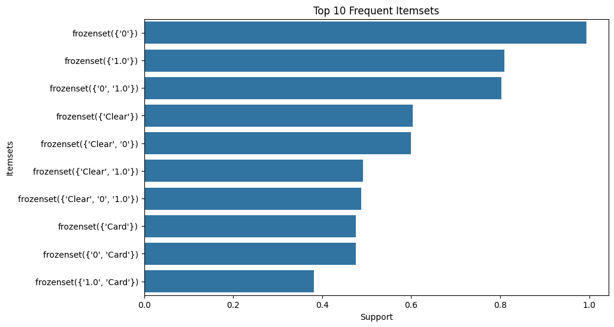
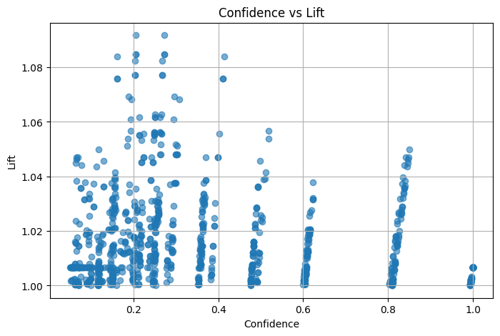
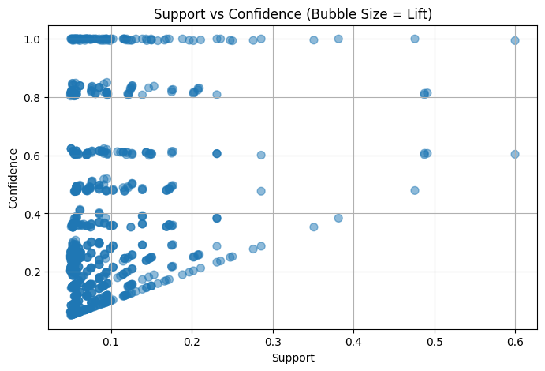

## Apriori Algorithm Case Study – Association Rule Mining

This project implements the **Apriori Algorithm** for association rule mining using a real-world ride-sharing dataset consisting of **8,000 trip records**.  
The analysis focuses on discovering meaningful relationships between trip characteristics such as vehicle type, payment method, weather, time of day, surge pricing, cancellations, and fare behavior.


## Dataset Description

The dataset includes **8,000 rows** of ride trip information with the following attributes:

| Column Name        | Description |
|--------------------|-------------|
| vehicle_type       | Type of vehicle (Sedan, SUV, Hatchback, etc.) |
| payment_type       | Transaction method (Card, Cash, UPI, Wallet) |
| weather            | Weather conditions during the trip |
| time_of_day        | Morning, Afternoon, Evening, Night |
| surge_multiplier   | Surge pricing applied |
| is_cancelled       | Whether the trip was cancelled (0/1) |
| high_fare          | Flag indicating if fare was high (0/1) |


### **Dataset Link**

**Dataset:** https://drive.google.com/file/d/1JYix38cDVVd_NJZnp7sz8NWLYsogLSGi/view?usp=sharing
---

## Objective

To discover **frequent itemsets** and **strong association rules** between categorical trip factors using the **Apriori Algorithm**.

---

## Problem Statement

Identify patterns in ride-sharing trip data to understand:

- Which combinations of factors occur frequently  
- How trip characteristics influence each other  
- Whether weather, payment types, time-of-day, or surge pricing impact cancellations or high fares  
- Actionable rules that describe customer behavior patterns  

---

## Methodology

1. **Data Cleaning**
   - Selected categorical fields relevant for Apriori
   - Converted all values to strings
   - Encoded into a transaction matrix

2. **Frequent Pattern Mining**
   - Applied Apriori with minimum support of 5%

3. **Rule Generation**
   - Generated association rules using:
     - Lift
     - Confidence
     - Support

4. **Visualization**
   - Support distribution
   - Frequent itemsets bars
   - Confidence vs Lift scatter
   - Bubble plots

---

## Implementation (Google Colab)

Use the link below to open the project notebook:

**Google Colab Notebook:** https://drive.google.com/file/d/1JYix38cDVVd_NJZnp7sz8NWLYsogLSGi/view?usp=sharing
--

### Install Dependencies
```python
!pip install mlxtend
```

### Run Apiori
```python
from mlxtend.frequent_patterns import apriori, association_rules
```

### Key Results

1. **Frequent itemsets reveal strong relationships between:**
   - Weather and time of day
   - Payment type and vehicle type
   - Surge pricing and high fare
   - Cancellation patterns under certain conditions
  
2. **Association rules highlight:**
   - Which trip characteristics predict cancellation
   - Which factors correlate with high fares
   - Strong lift values showing non-random relationships

## Some Results

1. 
2. 
3. 
4. 
